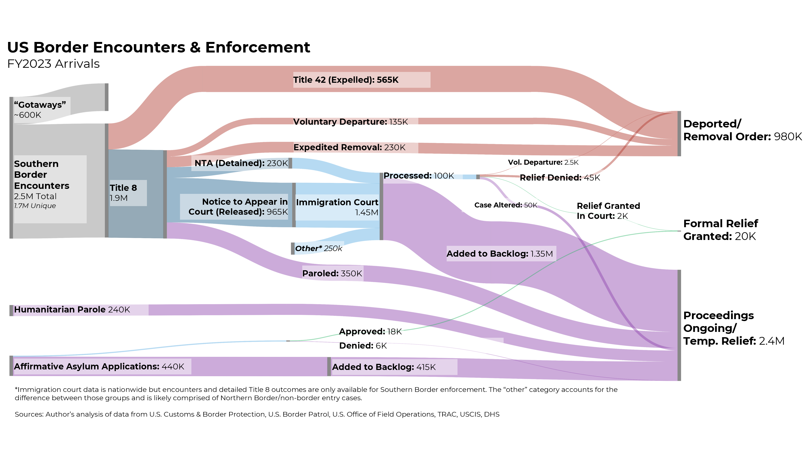

US Border Encounters & Enforcements 2023

Creates a Sankey graph of the flow of immigration from the world to 
the 'gotaways' and 'naturalized citizen' states, using Python.


To create a graph, execute in a CLI shell:

```shell
python plotly-sankey-immigration-working.py
```

How I Did This
----
The idea is vastly orthogonal to the use of most Sankey libraries which is by using column-based dataframes (except for Riley Xu's [Sankeyflow](https://github.com/riley-x/SankeyFlow) is row-based dataframe).

By using row-based dataframe (datapoint) approach, it becomes easier to map the node blocks on the map (despite `DS3Sankey.js` chaotic slapping of nodes all over the place after 13th node added).

Once `X:Y` coordinate of using 0.000 to 1.000 : 0.000 to 1.000 range is supported ONLY within Nodes, it becomes easier to construct LARGE Sankey charts.


Prior Work
-----

Based on Steve Rattner's work and aired on Morning Joe TV show.




Citations:
----
* https://stevenrattner.com/2023/11/steve-rattners-morning-joe-charts-the-border-at-a-breaking-point/
* U.S. Custom and Border Protection, Office of Field Operations
* U.S. Custom & Border Patrol
* * https://www.cbp.gov/newsroom/stats/nationwide-encounters
* * https://www.cbp.gov/newsroom/stats/custody-and-transfer-statistics
* * https://www.cbp.gov/newsroom/stats/cbp-enforcement-statistics
* * https://www.cbp.gov/newsroom/stats/cbp-enforcement-statistics/criminal-noncitizen-statistics
* TRAC
* * https://trac.syr.edu/immigration/
* USCIS
* * https://www.uscis.gov/citizenship-resource-center/naturalization-statistics
* * https://www.uscis.gov/tools/reports-and-studies/immigration-and-citizenship-data/eligible-to-naturalize-dashboard
* * https://www.uscis.gov/military/military-naturalization-statistics
* DHS, Office of Homeland Security Statistics
* * https://ohss.dhs.gov/topics/immigration/refugees-and-asylees/asylum-processing-rule-cohort-reports
* * https://ohss.dhs.gov/topics/immigration/legal-immigration-and-adjustment-status-report

